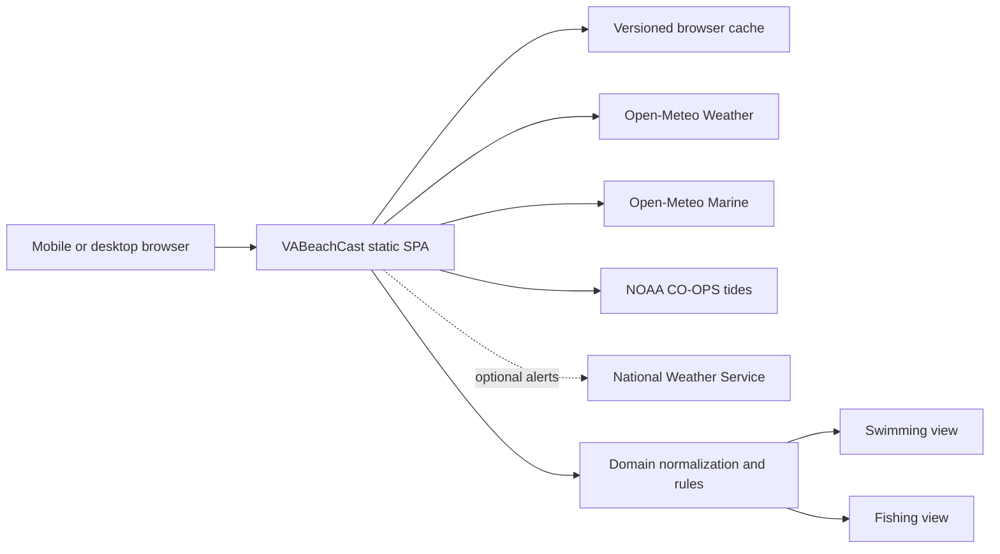
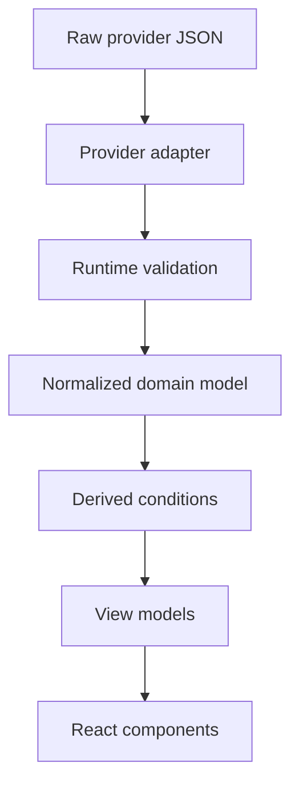

# Technical Architecture

## 1. Architecture decision

Build VABeachCast as a client-rendered static single-page application.

The browser retrieves public weather, marine, and tide data directly. No credentials, database, scheduled job, or application server is required for the initial release.



## 2. Recommended stack

| Concern            | Choice                             | Rationale                                                |
| ------------------ | ---------------------------------- | -------------------------------------------------------- |
| Build tool         | Vite                               | Small, fast static builds and simple deployment          |
| UI                 | React                              | Clear component/state model for independent feed states  |
| Language           | TypeScript with strict mode        | Protects provider adapters and derived calculations      |
| Styling            | CSS modules or colocated plain CSS | No runtime styling dependency is necessary               |
| Tide chart         | Custom semantic SVG                | Precise control, small bundle, accessible fallback       |
| Unit tests         | Vitest                             | Fast tests for adapters and boundary rules               |
| Component tests    | Testing Library                    | Behavior and accessibility-oriented assertions           |
| Browser tests      | Playwright                         | Responsive, navigation, failure, and accessibility flows |
| Formatting/linting | Prettier and ESLint                | Consistent code and early defect detection               |

Avoid a server-rendering framework for the MVP. There is no private data or server-only behavior, and a static application has the simplest cost and deployment model.

## 3. Source boundaries

Provider response shapes must not leak into components.



Each provider adapter is responsible for:

- Building its request URL
- Applying a request timeout
- Checking HTTP status
- Validating minimum response structure
- Converting missing/sentinel values to `null`
- Returning normalized timestamps and metric values
- Attaching source, model/prediction time, and fetch time

Components consume domain types only.

## 4. Suggested source tree

```text
src/
  app/
    App.tsx
    routes.ts
  components/
    alerts/
    conditions/
    forecast/
    layout/
    tide/
  config/
    location.ts
    rules.ts
  data/
    cache.ts
    fetch-json.ts
    open-meteo-marine.ts
    open-meteo-weather.ts
    noaa-tides.ts
    nws-alerts.ts
  domain/
    comfort.ts
    fishing.ts
    forecast-blocks.ts
    pressure.ts
    tide.ts
    wind.ts
  hooks/
    use-beach-data.ts
  pages/
    FishingPage.tsx
    SwimmingPage.tsx
  styles/
    global.css
    tokens.css
  types/
    domain.ts
    providers.ts
  test/
    fixtures/
    setup.ts
```

## 5. Domain model

The exact TypeScript design can evolve, but the normalized model should preserve source and freshness:

```ts
type DataSource =
  "open-meteo-weather" | "open-meteo-marine" | "noaa-tides" | "nws-alerts";

interface DataPoint<T> {
  value: T | null;
  validAt: string;
  fetchedAt: string;
  source: DataSource;
  kind: "modeled" | "predicted" | "derived" | "official-alert";
}

interface CurrentConditions {
  airTemperatureC: DataPoint<number>;
  waterTemperatureC: DataPoint<number>;
  waveHeightM: DataPoint<number>;
  wavePeriodS: DataPoint<number>;
  windSpeedKmh: DataPoint<number>;
  windGustKmh: DataPoint<number>;
  windDirectionDeg: DataPoint<number>;
  pressureHpa: DataPoint<number>;
  cloudCoverPct: DataPoint<number>;
}
```

Do not use `0` to represent an unavailable value.

## 6. Request lifecycle

1. Render the application shell and selected tab.
2. Read version-compatible cached results.
3. Render cached sections immediately with their timestamps.
4. Start weather, marine, tide, and optional alert requests in parallel.
5. Normalize and validate each response independently.
6. Recompute derived values when a dependency updates.
7. Replace the matching cached section after a successful response.
8. Keep a stale section visible when its refresh fails.
9. Announce only meaningful status changes to assistive technology.

Use `Promise.allSettled`, not `Promise.all`, so one rejected provider does not discard successful results.

## 7. Caching and freshness

Store a separate versioned cache entry per provider.

| Data                    | Normal refresh | Stale warning | Maximum fallback           |
| ----------------------- | -------------- | ------------- | -------------------------- |
| Current weather         | 15 minutes     | 30 minutes    | 6 hours                    |
| Hourly weather forecast | 30 minutes     | 2 hours       | 12 hours                   |
| Current marine          | 30 minutes     | 1 hour        | 6 hours                    |
| Marine forecast         | 1 hour         | 3 hours       | 12 hours                   |
| NOAA tide predictions   | 12 hours       | 24 hours      | End of covered range       |
| NWS active alerts       | 5 minutes      | 10 minutes    | Do not show expired alerts |

These are application policies, not provider update guarantees.

Recommended cache envelope:

```ts
interface CacheEnvelope<T> {
  schemaVersion: 1;
  provider: DataSource;
  fetchedAt: string;
  staleAt: string;
  expiresAt: string;
  data: T;
}
```

If storage is unavailable or corrupt, discard the entry and continue without failing the page. A matching schema version and provider name are not sufficient: cached payloads must pass the complete normalized-domain guards, including every nested datapoint, forecast item, tide event, and timestamp, before they enter application state. Envelope fetch, stale, and expiry times must also match the provider policy.

## 8. Time handling

Time handling is a high-risk part of this project because the user may view Sandbridge data from another timezone and daylight-saving changes occur inside long forecasts.

Rules:

- Store internal instants as ISO 8601 UTC strings.
- Accept provider timestamps only when they match the provider's documented shape and survive a calendar-component round trip; do not rely on permissive `Date.parse` normalization.
- Format every displayed time using `America/New_York`, never the device timezone.
- Query Open-Meteo weather and marine output in GMT, then format or group it in the Sandbridge timezone.
- Query NOAA tide output in GMT, parse it explicitly as UTC, then format it for Sandbridge.
- Request a one-day buffer before and after the visible NOAA range, then filter events by Sandbridge local date.
- Group forecast hours into days only after converting each instant to the target timezone.
- Never parse NOAA’s space-separated timestamp with the browser’s implementation-dependent `Date` parser.
- Use the live current instant for tide-event filtering and reserve `fetchedAt` for freshness and age labels.

Using GMT from NOAA avoids ambiguous local timestamps during the fall daylight-saving transition.

## 9. Tide calculation

NOAA station `8639428` is a subordinate prediction station and supplies high/low events, not a continuous interval series.

The app constructs a display curve between two adjacent extrema:

```text
x = clamp((t - t0) / (t1 - t0), 0, 1)
height(t) = h0 + (h1 - h0) × (1 - cos(π × x)) / 2
```

This curve:

- Passes through both official predicted extrema
- Has a horizontal tangent at each high/low point
- Produces a visually natural tidal cycle

It does not turn the intermediate height into an official NOAA prediction. The graph and tracking point must say “estimated between predicted high/low events.”

## 10. State model

Each independent section uses:

```text
idle → loading → fresh
              ↘ error
cached → refreshing → fresh
                  ↘ stale
```

The page-level state is composed from section states; it is not a single loading boolean.

Expected presentation:

| State                 | Presentation                                                  |
| --------------------- | ------------------------------------------------------------- |
| Loading with no cache | Skeleton preserving final layout                              |
| Fresh                 | Normal content and updated time                               |
| Refreshing with cache | Existing content plus subtle refresh indicator                |
| Stale                 | Existing content, stale badge, failed-refresh message         |
| Error with no cache   | Compact error and retry action                                |
| Partial data          | Render available metrics and mark missing metrics unavailable |

## 11. Routing

Use two stable routes:

- `/` or `/?view=swimming`
- `/?view=fishing`

A query parameter is friendlier to static hosts than history-fallback routes. Unknown values fall back to Swimming.

The tab control follows the ARIA tabs pattern or uses ordinary links with clear current-page semantics. Ordinary links are preferred if each view is treated as a route.

## 12. Performance budget

| Budget              | Target                                          |
| ------------------- | ----------------------------------------------- |
| Initial JavaScript  | `<150 KB` gzip                                  |
| Initial CSS         | `<30 KB` gzip                                   |
| App shell render    | `<500 ms` on a typical modern mobile device     |
| Primary data target | `<2 s` under normal provider/network conditions |
| Layout shift        | Near zero after skeleton render                 |

Implementation tactics:

- Start fetches at application initialization.
- Avoid large chart, date, icon, and CSS frameworks.
- Use inline SVG icons or a small curated icon set.
- Render ten-day detail progressively after current conditions.
- Preconnect to the three API origins.
- Keep the tide calculation and SVG generation local and synchronous.

## 13. Security and privacy

- There are no user accounts or secrets.
- No precise device location is requested.
- Do not add analytics by default.
- Escape provider text before rendering; never inject raw alert HTML.
- Set a restrictive Content Security Policy where hosting permits.
- Pin dependencies and enable automated dependency updates.
- External links use safe `rel` attributes when opening a new tab.

## 14. Deployment model

The build output is static HTML, CSS, JavaScript, icons, and a manifest.

GitHub Pages is the simplest target for a personal, noncommercial app. Vercel or Netlify can host the same static output, but no serverless function is required.

Deployment must:

- Run lint, type checking, unit tests, and the production build.
- Publish only after all required checks pass.
- Use HTTPS.
- Preserve the query-string view selection.
- Expose attribution and source links in the deployed UI.

Free hosting and free API usage are policy- and quota-dependent; the documentation must not promise perpetual zero-cost operation.
